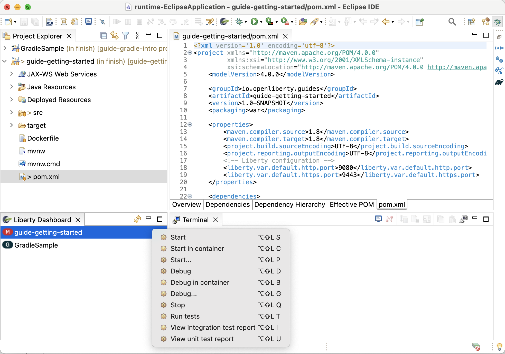
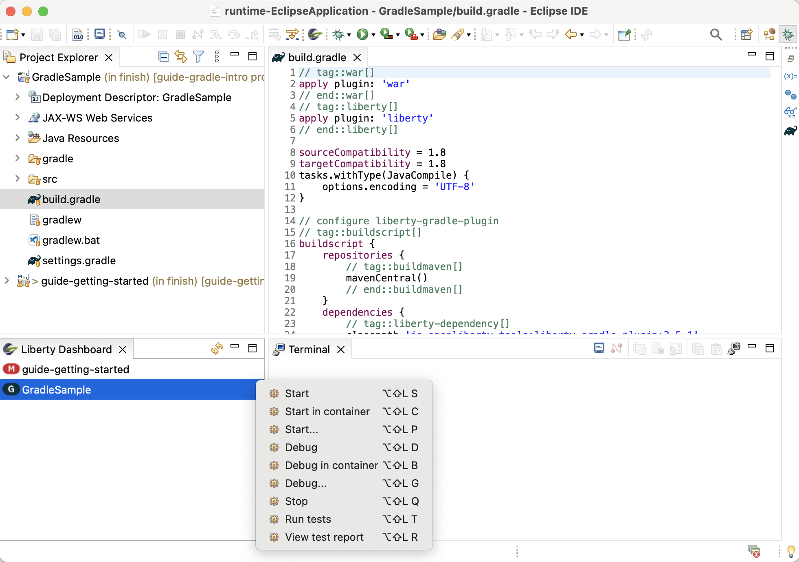
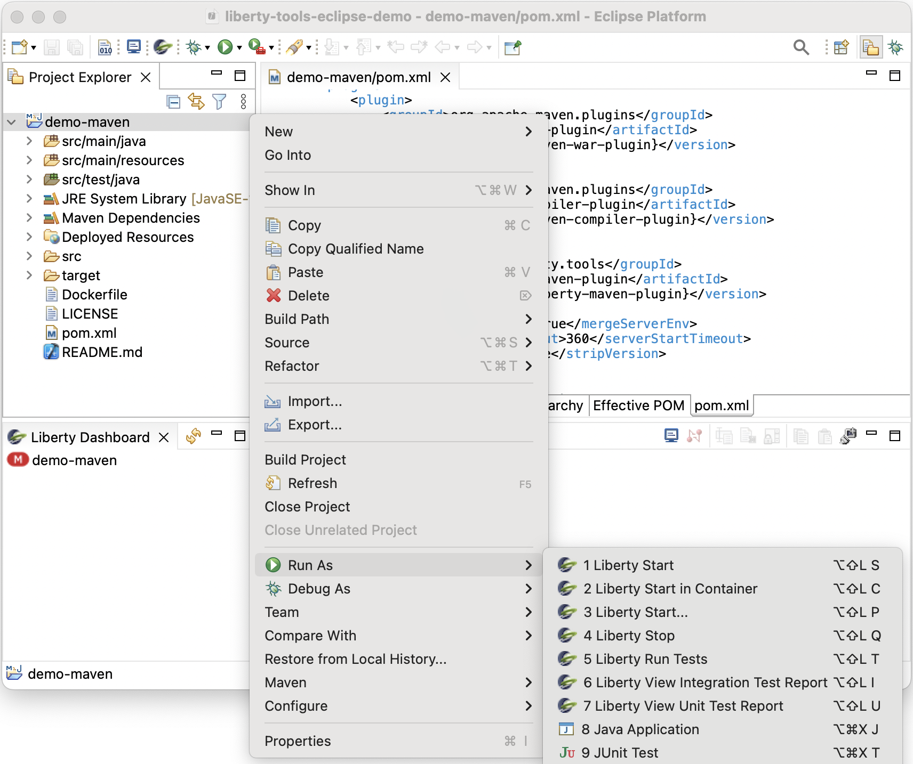

# Welcome to the Liberty Tools for Eclipse IDE project

> NOTE: Starting with the [0.3 early release](https://github.com/OpenLiberty/liberty-tools-eclipse/releases/tag/liberty-tools-0.3.0), Eclipse version 2022-09 and Java 17 are required. If using Eclipse version 2022-03 or 2022-06, you must use [Liberty Tools version 0.2 ](https://github.com/OpenLiberty/liberty-tools-eclipse/releases/tag/liberty-tools-0.2.0.202209201734).

A [Liberty](https://openliberty.io/) plugin for Eclipse IDE. The plugin allows you to run your Liberty Maven or
Liberty Gradle projects in dev mode through the Liberty dashboard view or through the project explorer view. You can start,
stop, or interact with [Liberty dev mode](https://openliberty.io/docs/latest/development-mode.html) on all configured
[Liberty Maven](https://github.com/OpenLiberty/ci.maven/blob/master/docs/dev.md#dev)
and [Liberty Gradle](https://github.com/OpenLiberty/ci.gradle/blob/master/docs/libertyDev.md) projects in your
workspace.

### Liberty dashboard

Maven Projects             | Gradle Projects
:-------------------------:|:-------------------------:
 | 

### Explorer view

 

## Quick Start

- [Install Liberty Tools](docs/installation.md).
- Install your Maven or Gradle application.
- Open the Liberty dashboard view by [clicking on the Open Liberty icon on the toolbar](https://github.com/OpenLiberty/liberty-tools-eclipse/blob/main/docs/user-guide.md#opening-the-liberty-dashboard-view), or open the project explorer view.
- Right-click on your application in the Liberty dashboard to view the available action commands, or, if you are using the project explorer view, right-click on your application and select the `Run As` entry on the menu to view the available Liberty launch shortcuts.

For detailed instructions on how to use the Liberty dashboard context menu commands or the Liberty launch shortcuts provided thought the project explorer view, check out the [User Guide](docs/user-guide.md) page.

## Features

- View supported projects in the dashboard.
- Start/Stop dev mode.
- Start dev mode with custom parameters.
- Start dev mode in a container.
- Start dev mode with the debugger attached.
- Run tests.
- View test reports.

## Action Commands

| Action Command                       | Description                                                                                                                                                                                                                                                                                                                  |
| ------------------------------------ | ---------------------------------------------------------------------------------------------------------------------------------------------------------------------------------------------------------------------------------------------------------------------------------------------------------------------------- |
| Start                                | Starts dev mode.                                                                                                                                                                                                                                                                                                             |
| Start...                             | Opens the Run Configurations dialog to customize and run dev mode. Supported parameters can be found in the documentation for the [dev goal of the Liberty Maven Plugin](https://github.com/OpenLiberty/ci.maven/blob/master/docs/dev.md#additional-parameters) and the [libertyDev task of the Liberty Gradle Plugin](https://github.com/OpenLiberty/ci.gradle/blob/master/docs/libertyDev.md#command-line-parameters). |
| Start in container                   | Starts dev mode with the server in a container.
| Debug...                             | Opens the Debug Configurations dialog to customize and run dev mode, and attach the debugger to the server JVM running the application.
| Stop                                 | Stops dev mode.                                                                                                                                                                                                                                                                                                              |
| Run tests                            | Runs the unit tests and integration tests that are configured for your project. This command requires dev mode to be already started.                                                                                                                                                                                        |
| View integration test report (Maven) | Opens the integration test report file if it exists at `/target/site/failsafe-report.html`. This action command is only available to Maven projects.                                                                                                                                                                                                                                                                                  |
| View unit test report (Maven)        | Opens the unit test report file if it exists at `/target/site/surefire-report.html`. This action command is only available to Maven projects.                                                                                                                                                                                                                                                                                             |
| View test report (Gradle)            | Opens the test report file if it exists at the default location: `build/reports/tests/test/index.html`. This action command is only available to Gradle projects. Gradle projects only have a single action command for test result reporting.                                                                     

## Contributing

Contributions to the Liberty Tools for Eclipse IDE plugin are welcome!

Our [CONTRIBUTING](CONTRIBUTING.md) document contains details for setting up your development environment and submitting pull requests.

## Issues

Please report bugs, issues and feature requests by creating
a [GitHub issue](https://github.com/OpenLiberty/liberty-tools-eclipse/issues)
