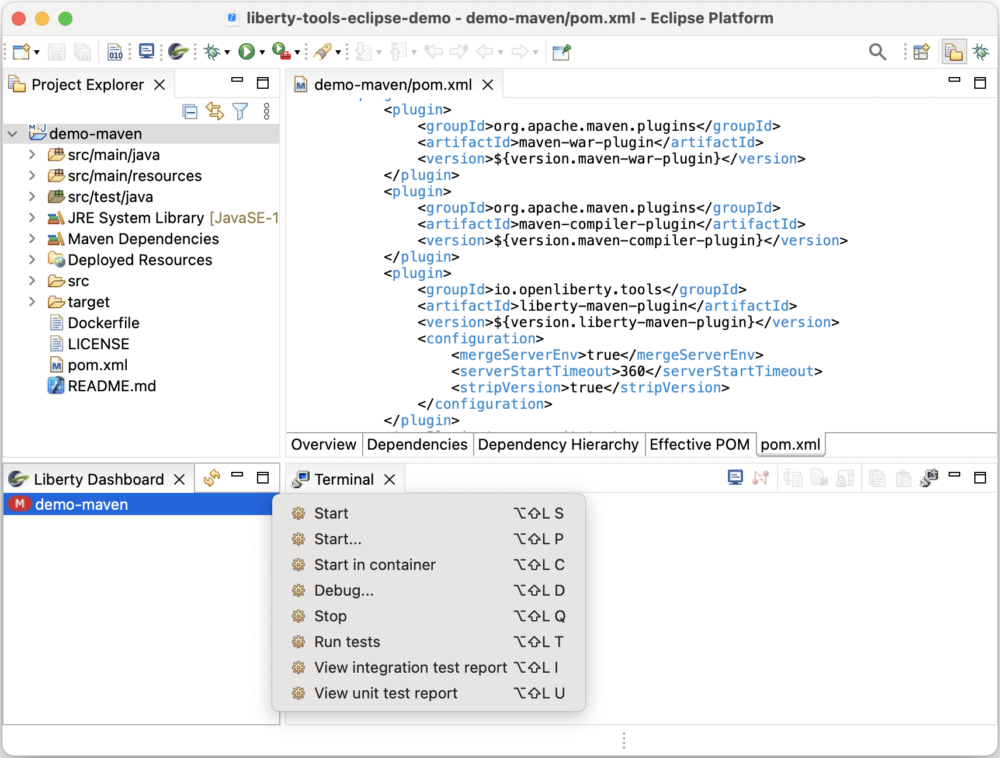
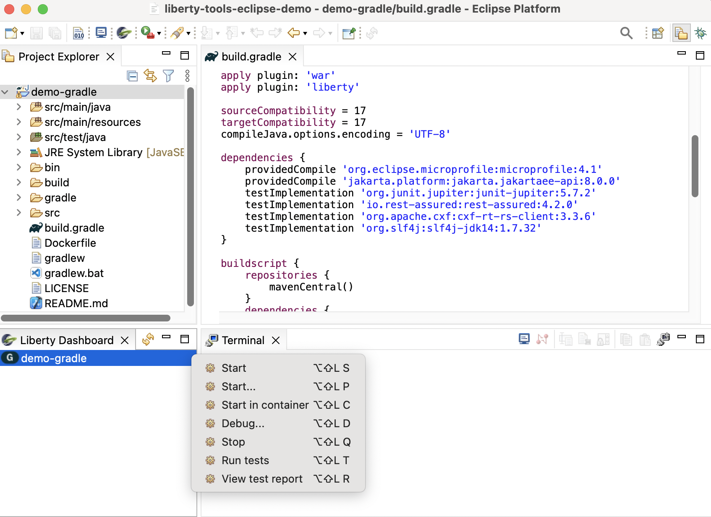

# Welcome to the Liberty Tools (for Eclipse) project

An [Open Liberty](https://openliberty.io/) plugin for Eclipse. The plugin will detect your Liberty Maven or
Liberty Gradle project, and using the Liberty tools dashboard view, you can start,
stop, or interact with [Liberty dev mode](https://openliberty.io/docs/latest/development-mode.html) on all configured
[Liberty Maven](https://github.com/OpenLiberty/ci.maven/blob/master/docs/dev.md#dev)
and [Liberty Gradle](https://github.com/OpenLiberty/ci.gradle/blob/master/docs/libertyDev.md) projects in your
workspace.

Maven Projects             | Gradle Projects
:-------------------------:|:-------------------------:
 | 

## Quick Start

- [Install Liberty Tools](docs/installation/installation.md).
- Install your Maven or Gradle application.
- Open the Liberty Tools dashboard view by clicking on the Open Liberty icon on the toolbar or by selecting the `Open Dashboard` option on the `Liberty` menu.  For more details see [Opening the Liberty tools dashboard view](https://github.com/OpenLiberty/liberty-tools-eclipse/blob/main/docs/getting-started/getting-started.md#opening-the-liberty-tools-dashboard-view). Once the dashboard is opened, existing Liberty supported projects will appear in the Liberty Tools dashboard view.
- Right-click on your application in the Open Liberty tools dashboard to view the available action commands.

For more detailed instructions on making use of the Open Liberty Tools dashboard context menu action commands, check out the  [Getting Started](docs/getting-started/getting-started.md) page.

## Features

- View supported projects in the dashboard.
- Start/Stop dev mode.
- Start dev mode with custom parameters.
- Start dev mode in a container.
- Run tests.
- View test reports.

## Action Commands

| Action Command                       | Description                                                                                                                                                                                                                                                                                                                  |
| ------------------------------------ | ---------------------------------------------------------------------------------------------------------------------------------------------------------------------------------------------------------------------------------------------------------------------------------------------------------------------------- |
| Start                                | Starts dev mode.                                                                                                                                                                                                                                                                                                             |
| Start…                               | Starts dev mode with custom parameters. Supported parameters can be found in the documentation for the [dev goal of the Liberty Maven Plugin](https://github.com/OpenLiberty/ci.maven/blob/master/docs/dev.md#additional-parameters) and the [libertyDev task of the Liberty Gradle Plugin](https://github.com/OpenLiberty/ci.gradle/blob/master/docs/libertyDev.md#command-line-parameters). |
| Start in container                   | Starts dev mode with the server in a container.
| Stop                                 | Stops dev mode.                                                                                                                                                                                                                                                                                                              |
| Run tests                            | Runs the unit tests and integration tests that are configured for your project. This command requires dev mode to be already started.                                                                                                                                                                                        |
| View integration test report (Maven) | Opens the integration test report file if it exists at `/target/site/failsafe-report.html`. This action command is only available to Maven projects.                                                                                                                                                                                                                                                                                  |
| View unit test report (Maven)        | Opens the unit test report file if it exists at `/target/site/surefire-report.html`. This action command is only available to Maven projects.                                                                                                                                                                                                                                                                                             |
| View test report (Gradle)            | Opens the test report file if it exists at the default location: `build/reports/tests/test/index.html`. This action command is only available to Gradle projects. Gradle projects only have a single action command for test result reporting.                                                                     

## Contributing

Contributions to the Open Liberty Tools for Eclipse plugin are welcome!

Our [CONTRIBUTING](CONTRIBUTING.md) document contains details for setting up your development environment and submitting pull requests.

## Issues

Please report bugs, issues and feature requests by creating
a [GitHub issue](https://github.com/OpenLiberty/liberty-tools-eclipse/issues)
