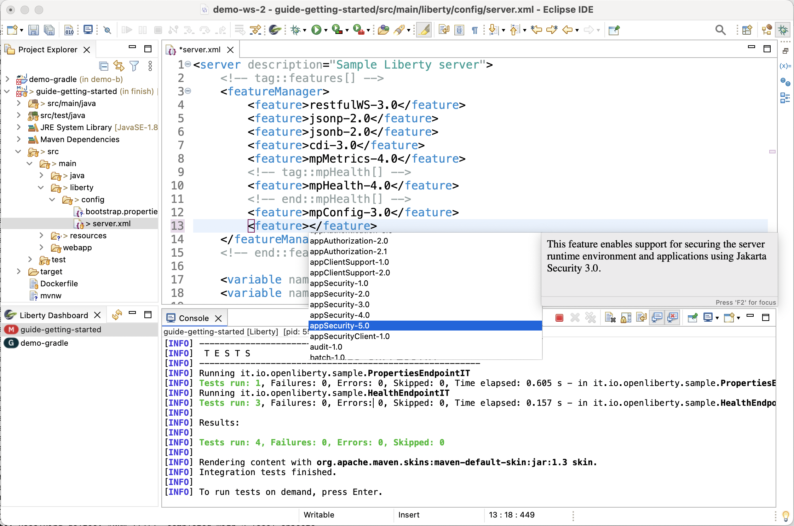

# Welcome to the Liberty Tools for Eclipse IDE project

A [Liberty](https://openliberty.io/) plugin for the Eclipse IDE. The plugin allows you to run your Liberty Maven or
Liberty Gradle projects in dev mode through the Liberty dashboard view or through the project explorer view. You can start,
stop, or interact with [Liberty dev mode](https://openliberty.io/docs/latest/development-mode.html) on all configured
[Liberty Maven](https://github.com/OpenLiberty/ci.maven/blob/master/docs/dev.md#dev)
and [Liberty Gradle](https://github.com/OpenLiberty/ci.gradle/blob/master/docs/libertyDev.md) projects in your
workspace.

---
- [Quick start](#quick-start)
- [Features](#features)
- [Action commands](#action-commands)
- [Contributing](#contributing)
- [Issues](#issues)

### Liberty dashboard

Maven Projects             | Gradle Projects
:-------------------------:|:-------------------------:
 | 

### Explorer view

 

## Quick start

- Understand the [prerequisites](docs/user-guide.md#before-you-begin)
- [Install Liberty Tools](docs/installation.md).
- Install your Maven or Gradle application.
- Open the Liberty dashboard view by [clicking on the Open Liberty icon on the toolbar](https://github.com/OpenLiberty/liberty-tools-eclipse/blob/main/docs/user-guide.md#opening-the-liberty-dashboard-view), or open the project explorer view.
- Right-click on your application in the Liberty dashboard to view the available action commands. If you are using the project explorer view, right-click on your application and select the `Run As` entry on the menu to view the available Liberty launch shortcuts.

For detailed instructions on how to use the Liberty dashboard context menu commands or the Liberty launch shortcuts in the project explorer view, check out the [User Guide](docs/user-guide.md) page.

## Features

- View supported projects in the dashboard.
- Start and stop dev mode.
- Start dev mode with custom parameters.
- Start dev mode in a container.
- Start dev mode with the debugger attached.
- Run tests.
- View test reports.
- Code with language assistance in the following configuration and application files:
  - `server.xml`, `server.env`, and `bootstrap.properties` Liberty configuration files
  - Jakarta EE 9.x APIs in Java files 
  - MicroProfile APIs in `microprofile-config.properties` and Java files
 
 The following screen captures demonstrate some of the Liberty Tools language assistance features.

Code completion in `server.xml` files helps you quickly edit your Liberty runtime configuration.

Similar code assistance is provided for `bootstrap.properties` files (and `server.env` though not shown):

Helpful code snippets are provided in Java files for Jakarta EE APIs such as Jakarta RESTful Web Services.

Code completion for `microprofile-config.properties` files helps you easily set properties for MicroProfile APIs.

Editing assistance for configuration and application files is provided through the following language server projects, which this project consumes. For more information, see the documentation for these projects.

- Liberty configuration files: [Liberty Config Language Server](https://github.com/OpenLiberty/liberty-language-server#liberty-config-language-server)
- Jakarta EE APIs in Java files:  [Eclipse LSP4Jakarta](https://github.com/eclipse/lsp4jakarta#eclipse-lsp4jakarta), the Language Server for Jakarta EE.
- MicroProfile APIs in `microprofile-config.properties` and Java files: [Eclipse LSP4MP](https://github.com/eclipse/lsp4mp#eclipse-lsp4mp---language-server-for-microprofile), the Language Server for MicroProfile.

## Action commands

| Action command                       | Description                                                                                                                                                                                                                                                                                                                  |
| ------------------------------------ | ---------------------------------------------------------------------------------------------------------------------------------------------------------------------------------------------------------------------------------------------------------------------------------------------------------------------------- |
| Start                                | Starts dev mode.                                                                                                                                                                                                                                                                                                             |
| Start in container                   | Starts dev mode with the server in a container.
| Start...                             | Opens the Run Configurations dialog to customize and run dev mode. You can find the supported parameters in the documentation for the [dev goal of the Liberty Maven Plugin](https://github.com/OpenLiberty/ci.maven/blob/master/docs/dev.md#additional-parameters) and the [libertyDev task of the Liberty Gradle Plugin](https://github.com/OpenLiberty/ci.gradle/blob/master/docs/libertyDev.md#command-line-parameters). |
| Debug                                | Starts dev mode and attaches the debugger to the server JVM running the application. 
| Debug in container                   | Starts dev mode with the server in a container and attaches the debugger to the JVM within the container.
| Debug...                             | Opens the Debug Configurations dialog to customize and run dev mode, and attaches the debugger to the server JVM that is running the application.
| Stop                                 | Stops dev mode.                                                                                                                                                                                                                                                                                                              |
| Run tests                            | Runs the unit tests and integration tests that are configured for your project. This command requires that dev mode is already started.                                                                                                                                                                                        |
| View integration test report (Maven) | Opens the integration test report file if it exists at `/target/site/failsafe-report.html`. This action command is only available to Maven projects.                                                                                                                                                                                                                                                                                  |
| View unit test report (Maven)        | Opens the unit test report file if it exists at `/target/site/surefire-report.html`. This action command is only available to Maven projects.                                                                                                                                                                                                                                                                                             |
| View test report (Gradle)            | Opens the test report file if it exists at the default location: `build/reports/tests/test/index.html`. This action command is available only to Gradle projects. Unlike Maven projects, Gradle projects have only a single action command for test result reporting.                                                                     

## Contributing

Contributions to the Liberty Tools for Eclipse IDE plugin are welcome!

Our [CONTRIBUTING](CONTRIBUTING.md) document contains details for setting up your development environment and submitting pull requests.

## Issues

Please report bugs, issues and feature requests by creating
a [GitHub issue](https://github.com/OpenLiberty/liberty-tools-eclipse/issues)
