# Getting Started

## Before you begin

### Software requirements

- **Eclipse IDE:** Starting with the Liberty Tools 0.3 early release, Eclipse version 2022-09 is required. Tested with Eclipse IDE for Enterprise Java and Web Developers packages.

- [Liberty Tools feature](../installation/installation.md).

### Application requirements

- Define a Liberty server.xml configuration file at location src/main/liberty/config.

- Configure the [Liberty Maven Plugin](https://github.com/OpenLiberty/ci.maven#configuration) or [Liberty Gradle Plugin](https://github.com/OpenLiberty/ci.gradle#adding-the-plugin-to-the-build-script). We recommend using newer versions of the plugins as several important bug fixes have been included in recent versions.

  Recommended minimum versions of:

  - Liberty Maven Plugin -> 3.7.1
    
  - Liberty Gradle Plugin -> 3.5.1

### Avoid trouble - Starting Eclipse with the correct environment

Since the Liberty Tools feature uses the well-known environment variables: PATH and JAVA_HOME, you will encounter problems if these variables are not set within your Eclipse IDE process, e.g. the mvn executable might not be found.

There are several methods that can be used to potentially address this:

1. On MacOS, start eclipse through Finder:
    - right-click your Eclipse application and choose Show Package Contents.
    - Enter the newly displayed Contents folder, select MacOS, and then run Eclipse by clicking the displayed executable.

2. Generate a mvn wrapper into the project:
    - In your project folder execute the mvn wrapper create command:
    - `mvn org.apache.maven.plugins:maven-wrapper-plugin:3.1.1:wrapper`
    - start eclipse as normal

## Opening the Liberty tools dashboard view

Click on the Open Liberty icon on the toolbar.

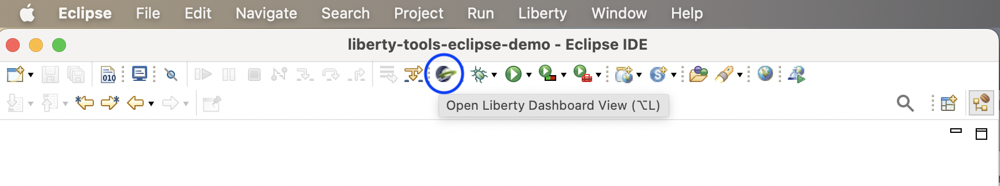

Alternatively, click on the `Open Dashboard` option in the `Liberty` menu. 

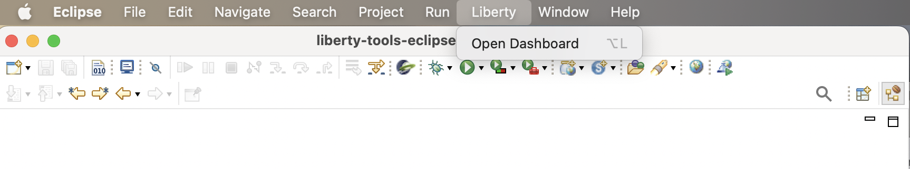

If the dashboard is opened and there are application projects that already properly configured to run on Liberty and use Liberty dev mode, those projects are automatically added to the dashboard when it opens.

If you add new projects or make changes, and you need the dashboard to be refreshed, use the refresh icon in the dashboard toolbar.

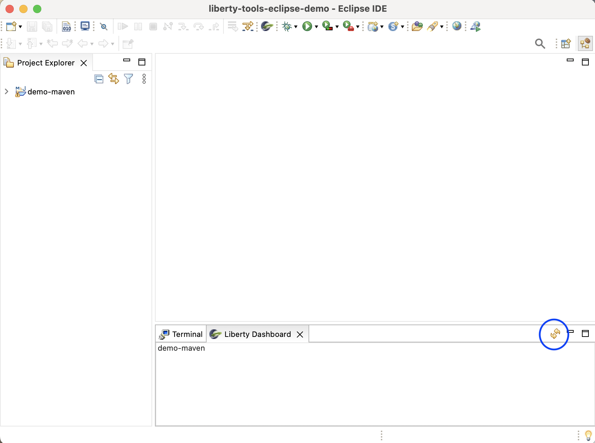

The Liberty tools dashboard provides a context menu to the projects in it. Users can choose the menu contents to perform a series of operations aiming to speed up application development.

Maven Projects             | Gradle Projects
:-------------------------:|:-------------------------:
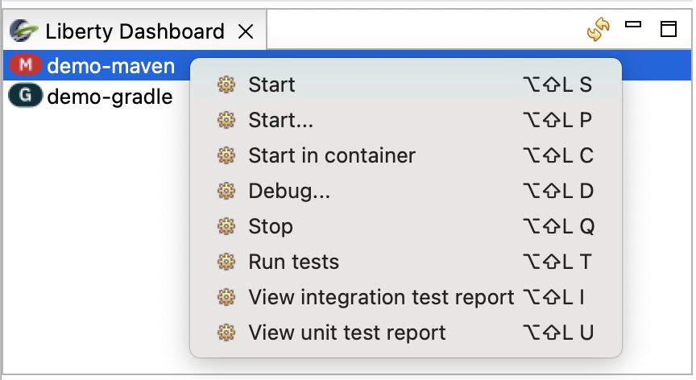 | 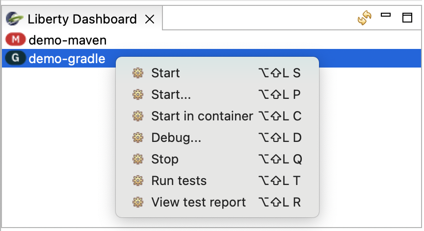

## Running your application on Liberty using dev mode

There are 3 ways to start your application in dev mode by using the dashboard menu actions associated with each of your application projects.

### Start

If you want to start your application project in dev mode, right click on the project name listed in the dashboard, and click on the `Start` action. A new terminal tab will open to run the application in dev mode.

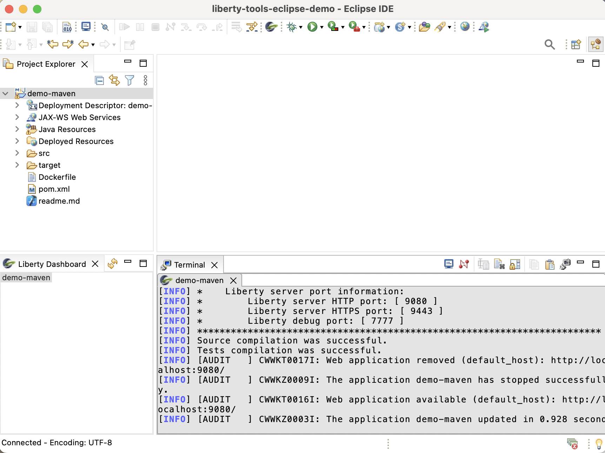

### Start with parameters

If you want to start your application project in dev mode with custom parameters such as -DhotTests=true, right click on the project name listed in the dashboard, and click on the  `Start...` action. 

A popup view will appear prompting you for custom parameters. Add the needed parameters and click `OK`. 

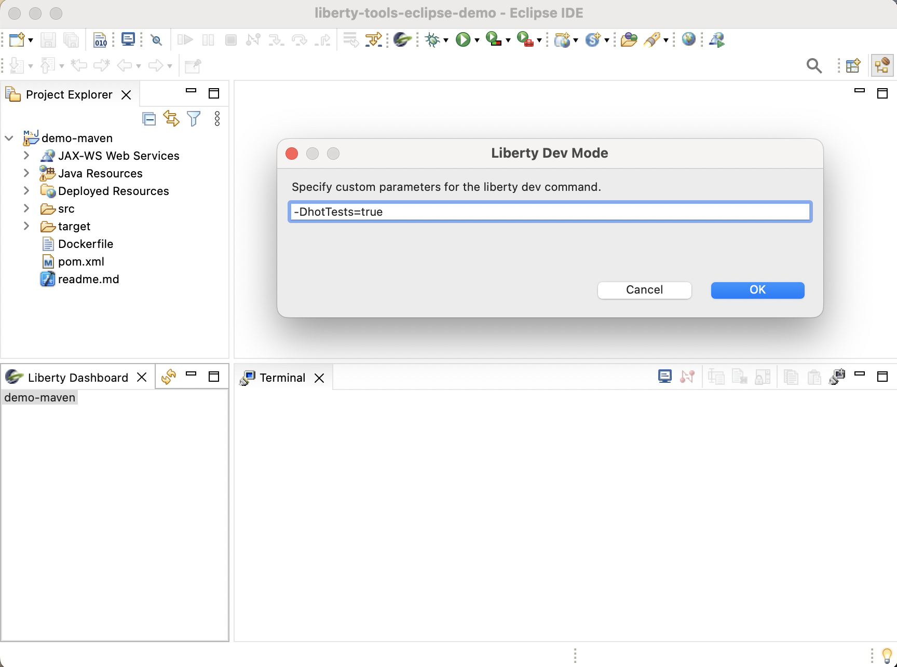

A new terminal tab will open to run the application in dev mode. 

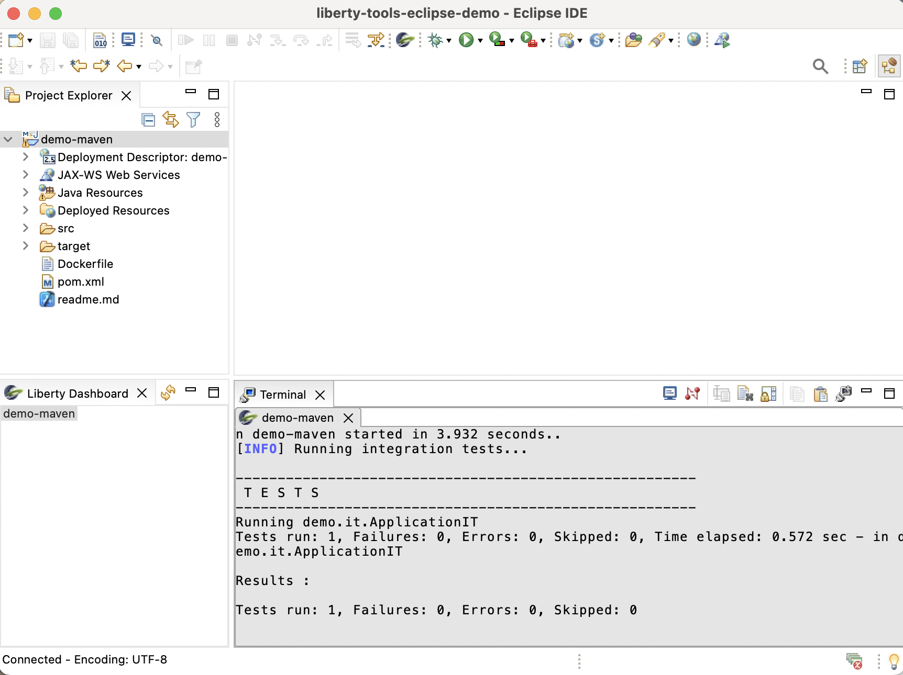

For a full list of supported parameters, check out the [Liberty Maven dev goal parameters](https://github.com/OpenLiberty/ci.maven/blob/main/docs/dev.md#additional-parameters) or the [Liberty Gradle dev task parameters](https://github.com/OpenLiberty/ci.gradle/blob/main/docs/libertyDev.md#command-line-parameters).

### Start in container

If you want to make use of dev mode for containers, right click on the project name listed in the dashboard, and click on the `Start in container` action. 

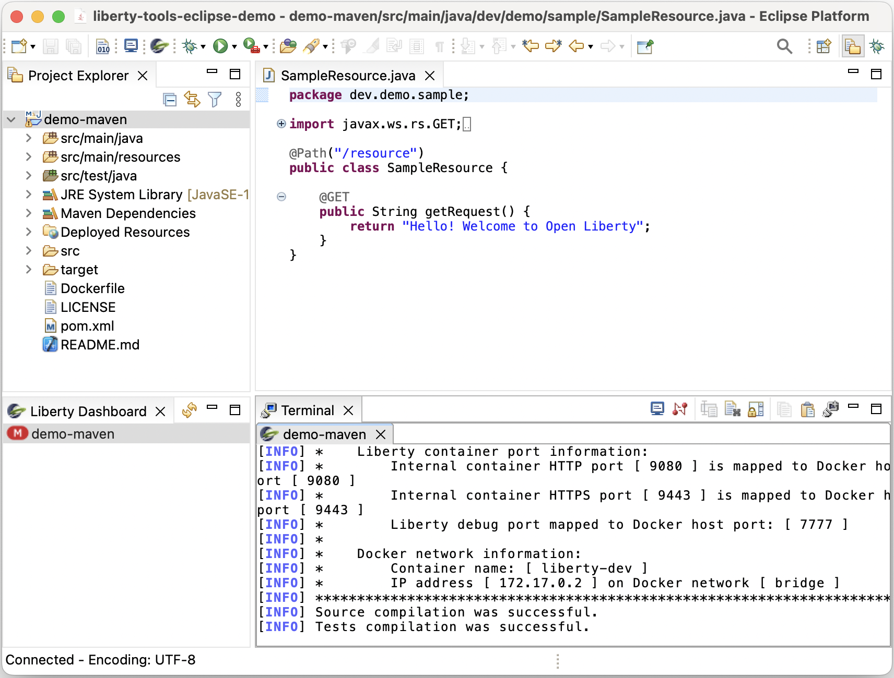

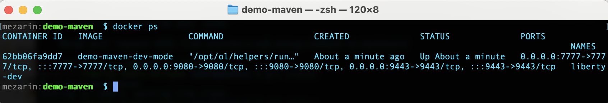

For more information on dev mode for containers, check out the [Liberty Maven devc goal](https://github.com/OpenLiberty/ci.maven/blob/main/docs/dev.md#devc-container-mode) or the [Liberty Gradle libertyDevc task](https://github.com/OpenLiberty/ci.gradle/blob/main/docs/libertyDev.md#libertydevc-task-container-mode).

## Running your application's tests

Once you are [running your application on Liberty using dev mode](#running-your-application-on-liberty-using-dev-mode), you can easily run the tests provided by your application. 

To do this, go to the Liberty tools dashboard, right click on the listed application project name, and select the `Run tests` action. The tests are run in the corresponding terminal.

## Viewing your application's test reports

Once you are done [running your application's tests](#running-your-applications-tests), you can access the produced test reports.

### Maven built Application.

To view the integration test report right click on the project name listed in the dashboard, and click on the `View integration test report` action.

To view the unit test report for Maven built applications, right click on the project name listed in the dashboard, and click on the `View unit test report` action.

### Gradle built Application.

To view the test report, right click on the project name listed in the dashboard, and click on the `View test report` action.

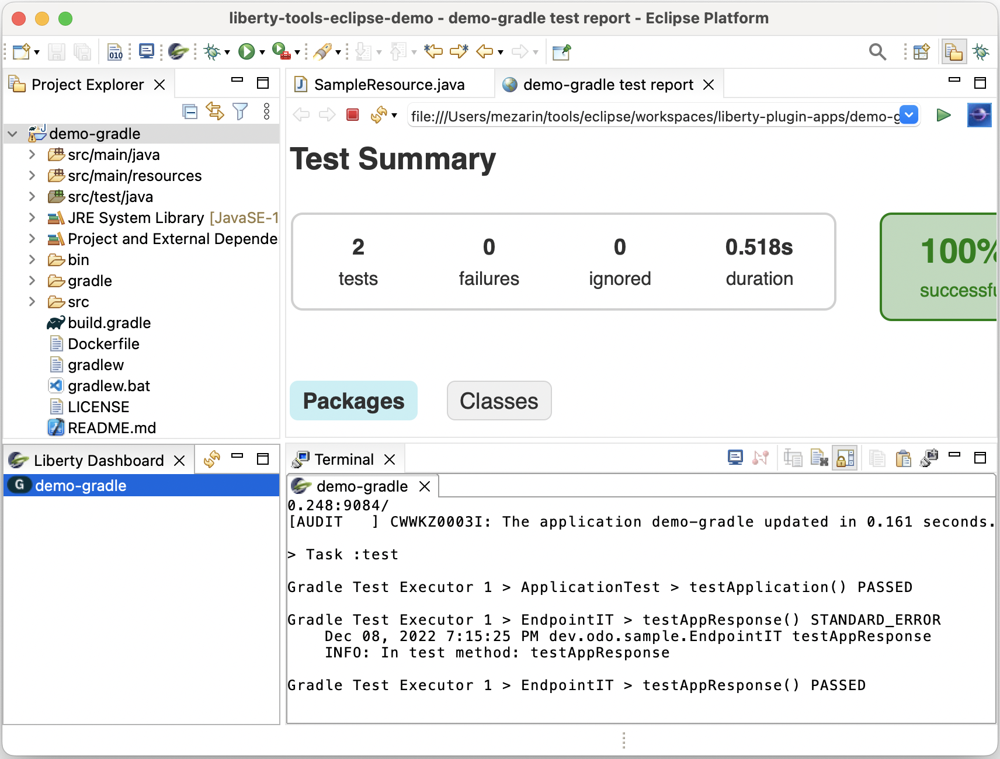

Note that test reports are opened either in your Eclipse IDE's internal browser or an external browser depending on your Eclipse IDE's browser configuration preferences.

## Stopping your application.

To stop your application project, go to the Liberty tools dashboard, right click on the project you wish to stop, and select the `Stop` action.

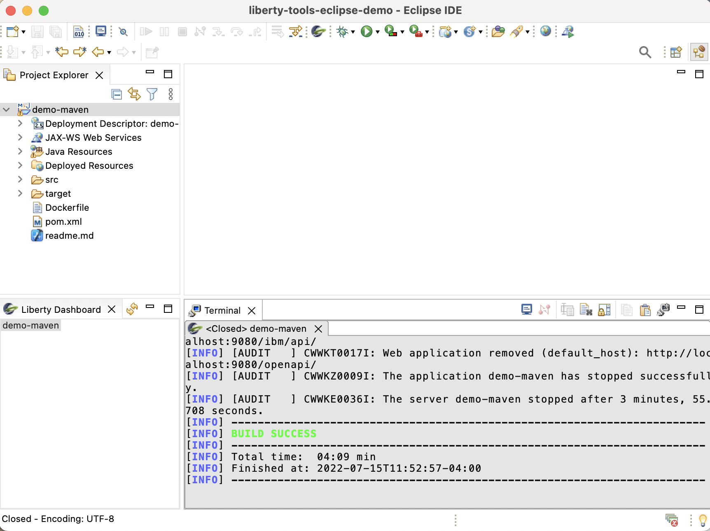

Once the project is stopped, the terminal in which it ran is closed.

## Configuring a Liberty server (editing server.xml)

1. Start the project in dev mode, using one of the dashboard start commands above.  This will install the Liberty features required for your app and allow the generation of a corresponding server.xml XSD schema file.

2. Double-click on your server.xml file which will cause it to be opened in the "Generic Text Editor" (an editor in which the function here is enabled).

3. Proceed to use development support:  hover support, content assist via clicking to insert the cursor then typing `<Ctrl>+<Space>` at a given point within the document.

## Developing MicroProfile applications

1. Start dev mode.
2. Open a Java or microprofile-config.properties file.
3. Proceed to take advantage of the MicroProfile Language Server support: hover support, content assist (via `<Ctrl>+<Space>`), etc.

Though it is not written for Liberty Tools specifically, [this article](
https://microprofile.io/2020/09/25/announcement-language-server-for-microprofile-and-the-tools-for-microprofile-vs-code-extension/) shows the MicroProfile Language Server tooling features in another context.

