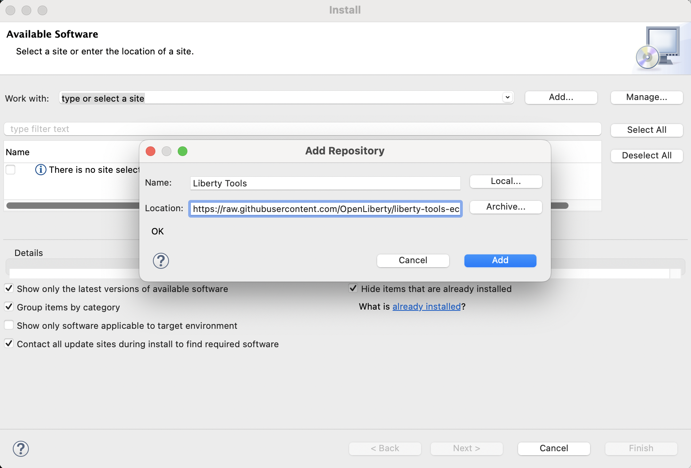
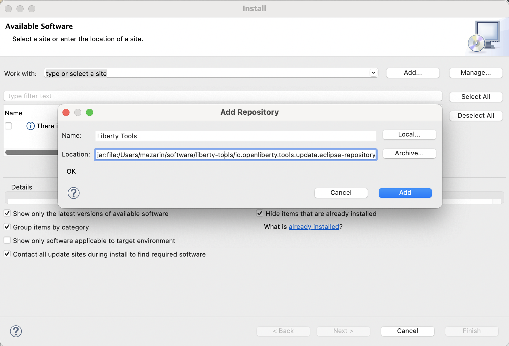
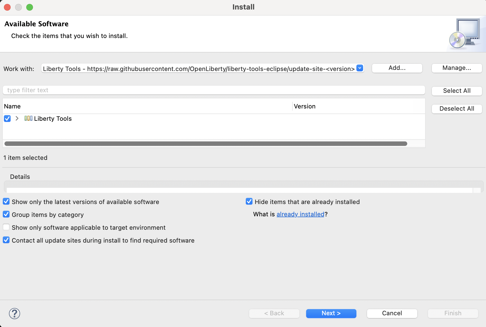
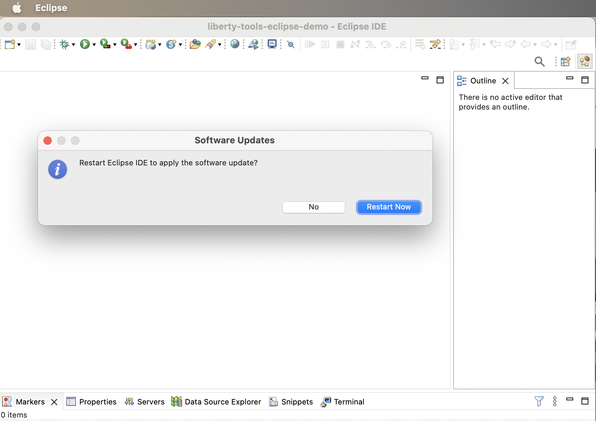

# Installation guide

## Prerequisites
See the [user guide](user-guide.md#before-you-begin) for install requirements

## Installation options
You can install Liberty Tools as new software by one of the following methods:

*  Using the Eclipse Marketplace
*  Configuring an update site
*  Downloading the artifacts and installing them by using the archive

## Using Eclipse Marketplace

1. Point your browser to the Liberty Tools marketplace entry: https://marketplace.eclipse.org/content/liberty-tools
2. Drag the **Install** button to the toolbar of your Eclipse IDE

## Using the Eclipse Marketplace client

1. From the Eclipse menu in your IDE, select **Help** > **Eclipse Marketplace** and type **"Liberty Tools"**.

    **NOTE:** Do NOT select the "IBM Liberty Developer Tools" selection, which is an earlier, different set of IDE features/plugins, though with the similar name.

## Using Help -> Install New Software

You can use the **Install New Software** option to install Liberty Tools by using an update site or through an archive.

1. From the Eclipse menu in your IDE, select **Help** > **Install New Software**.

2. For any release in the [Releases](https://github.com/OpenLiberty/liberty-tools-eclipse/releases) list, you can add the installation artifacts either from an update site or from a downloadable archive. The entry for each release page includes the URLs for both options.
    
    a. **UPDATE SITE** 

    Find the update site URL for your chosen release from the entry in the Releases list. For example, the URL for the [0.7.0 release](https://github.com/OpenLiberty/liberty-tools-eclipse/releases/tag/liberty-tools-0.7.0.202212141445) is https://public.dhe.ibm.com/ibmdl/export/pub/software/openliberty/liberty-tools-eclipse/0.7.0/repository/.

    Click the **Add...** button to open the **Add Repository** view. Specify a name, copy and paste the update site URL as the location, and click the **Add** button. 

    
 
    b. **ARCHIVE** 

    Find the URL for the archive zip for your chosen release from the entry in the Releases list. For example, the URL for the 0.7.0 release is https://public.dhe.ibm.com/ibmdl/export/pub/software/openliberty/liberty-tools-eclipse/0.7.0/repository.zip

    Download this zip to your local workstation and copy the path to the downloaded archive.

    Click on the **Add...** button to open the **Add Repository** view. Specify a name, paste the location of the downloaded archive, and click the **Add** button. 

    

3. Select the Liberty tools software and click **Next**.

4. Review the installation details and click **Next**.

5. Review and accept the license agreement and click **Finish**.

6. Trust - Depending on your original IDE package, you might be required to accept trust of **org.apache.commons3.lang**, a prerequisite of the LSP4Jakarta component used by Liberty Tools.

7. Restart Eclipse at the prompt.

### Next steps

FOr detailed information about using Liberty Tools, see the [User Guide](../user-guide.md).
