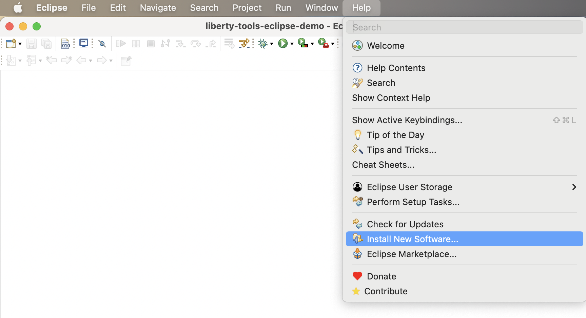
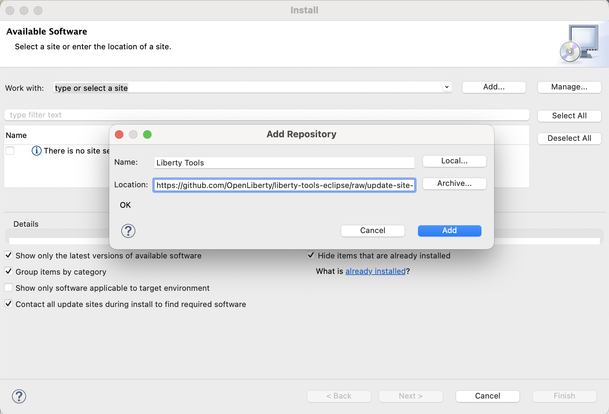
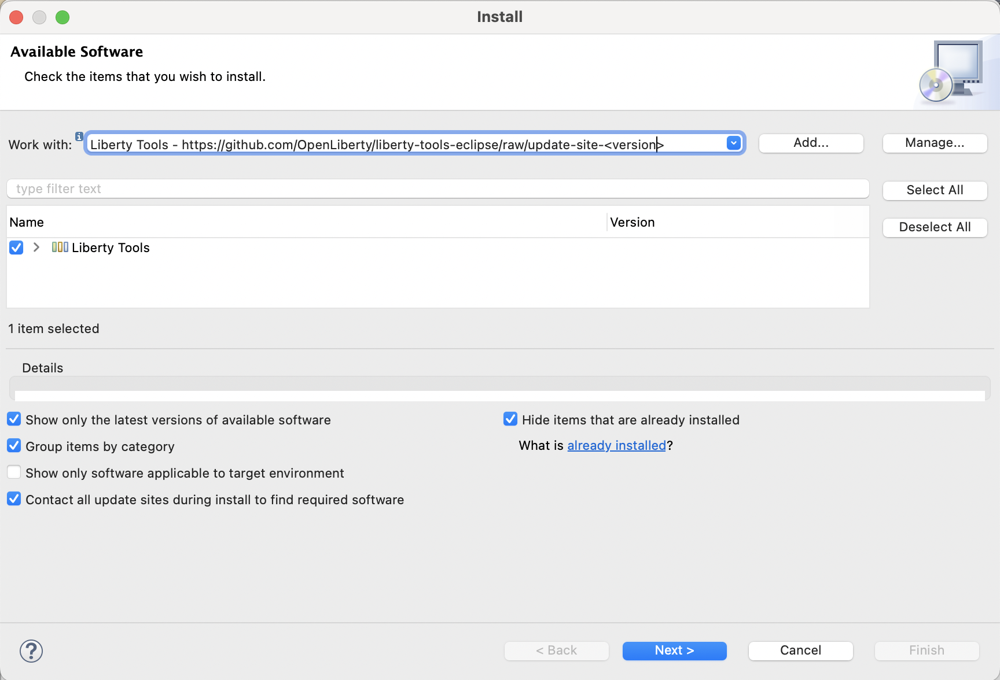

# Installation

> NOTE: The latest [v0.8.0 early release](https://github.com/OpenLiberty/liberty-tools-eclipse/releases/tag/liberty-tools-0.8.0.202301250158) has been tested with Eclipse versions 2022-09 (v4.25) and 2022-12 (v4.26), with Java 17 required.

The Liberty Tools feature can be installed as new software either by using the Eclipse Marketplace, configuring an update site or by downloading the artifacts and installing using the archive.

## Using Eclipse Marketplace

1. Point your browser to the Liberty Tools marketplace entry: https://marketplace.eclipse.org/content/liberty-tools
2. Drag the "Install" button to the toolbar of your Eclipse IDE

## Using Eclipse Marketplace client

1. Go to menu:  `Help`->`Eclipse Marketplace` and type **"Liberty Tools"**.

    **NOTE:** Do NOT select the "IBM Liberty Developer Tools" selection, which is an earlier, different set of IDE features/plugins, though with the similar name.

## Using Help -> Install New Software

The Liberty Tools feature can be installed using the artifacts provided in the form of an update site or through an archive.

1. Go to menu: `Help`->`Install New Software`.

2. Add the location containing the plugin's installation artifacts. This can be done in two ways:
    
    a. Using an update site, with Location URL: https://public.dhe.ibm.com/ibmdl/export/pub/software/openliberty/liberty-tools-eclipse/0.8.0/repository/

    Click on the `Add...` button to open the `Add Repository` view. Specify a name, copy/paste the URL above as the location, and click on the `Add` button. 

    
 
    b. Using an archive. The archive is provided at a related link on the IBM DHE download site: https://public.dhe.ibm.com/ibmdl/export/pub/software/openliberty/liberty-tools-eclipse/0.8.0/repository.zip

    Download this zip to your local workstation and copy the path to the downloaded archive.

    Click on the `Add...` button to open the `Add Repository` view. Specify a name, paste the location of the downloaded archive, and click on the `Add` button. 

    

3. Select the Liberty tools software and click `Next`.

4. Review the installation details and click `Next`.

5. Review/Accept the License agreement and click `Finish`.

6. Trust - Depending on your original IDE package you may be required to accept trust of **org.apache.commons3.lang**, a prerequisite of the LSP4Jakarta component used by Liberty Tools.

7. Restart Eclipse at the prompt.

### Avoid trouble

#### Docker 

The Liberty Tools `Start in container` function detects what Docker executable to use by checking the Docker executable defined on the PATH environment variable. Be sure that the PATH is also visible to the terminal in your Eclipse IDE.

### Next steps

See: [Getting Started](../getting-started/getting-started.md)
