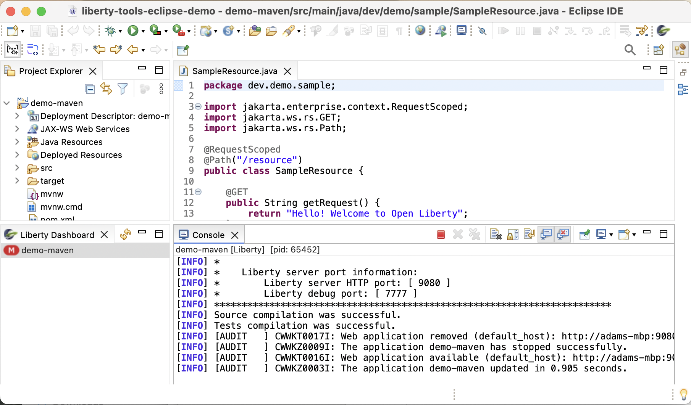
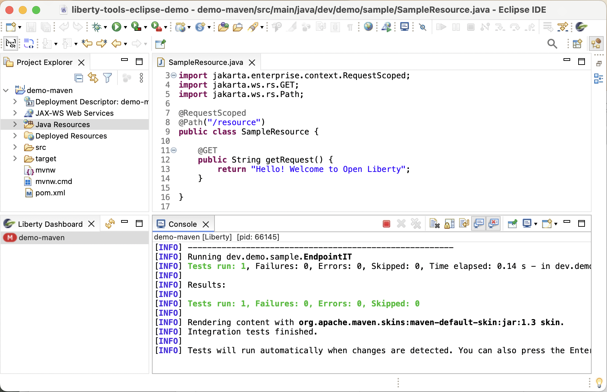
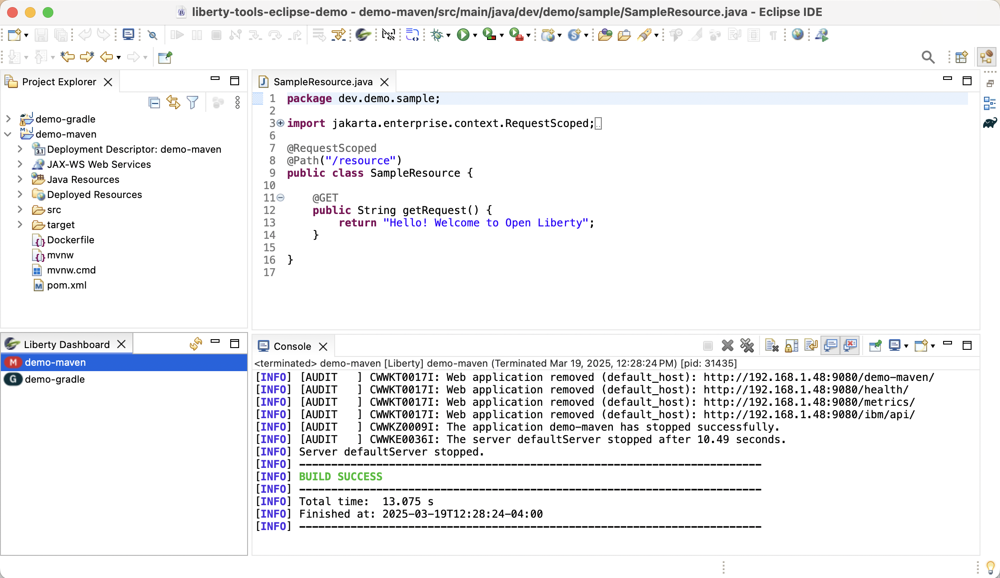
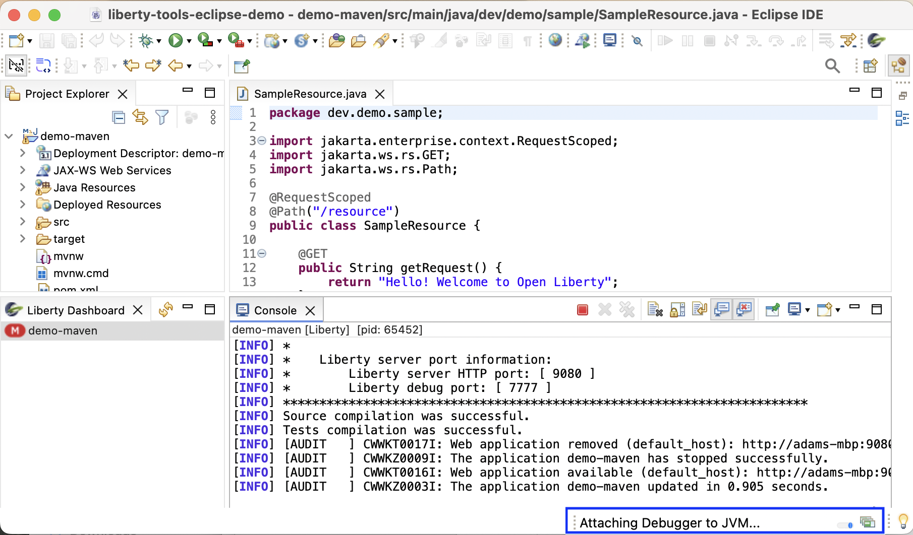
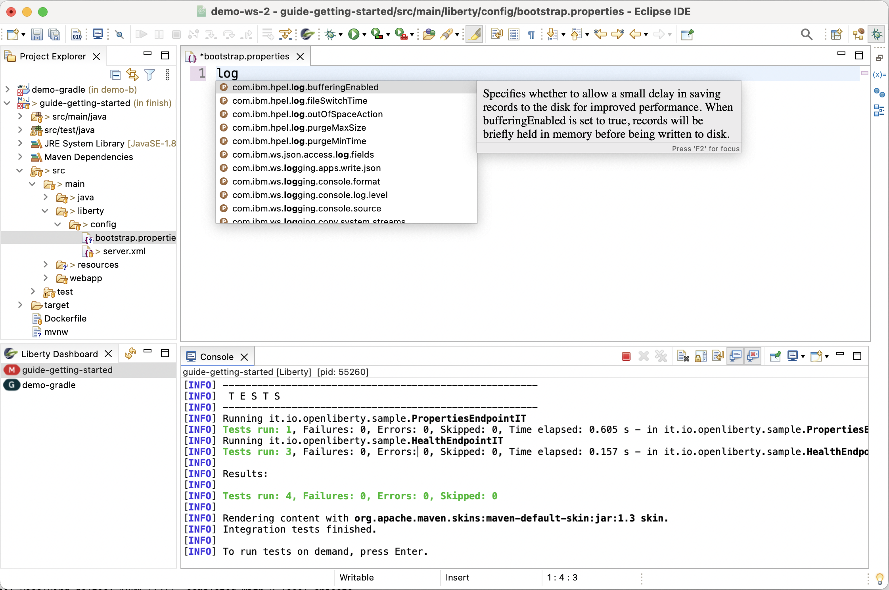
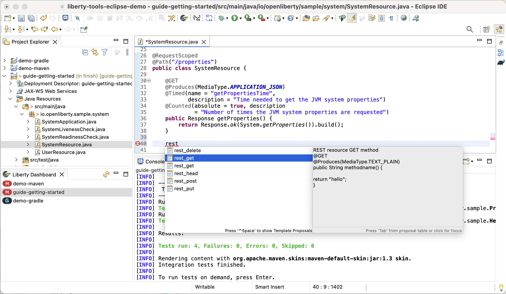

- [User Guide](#user-guide)
  * [Before you begin](#before-you-begin)
    + [Software requirements](#software-requirements)
    + [Application requirements](#application-requirements)
    + [Maven and Gradle](#maven-and-gradle)
    + [Docker](#docker)
  * [Opening the Liberty dashboard view](#opening-the-liberty-dashboard-view)
  * [Running your application on Liberty using dev mode](#running-your-application-on-liberty-using-dev-mode)
    + [Using the Liberty dashboard view](#using-the-liberty-dashboard-view)
    + [Using the Project Explorer view](#using-the-project-explorer-view)
    + [Start](#start)
    + [Start with Configuration](#start-with-configuration)
    + [Start in container](#start-in-container)
  * [Running tests](#running-tests)
  * [Viewing test reports](#viewing-test-reports)
    + [Maven built application](#maven-built-application)
    + [Gradle built application](#gradle-built-application)
  * [Stopping your application](#stopping-your-application)
  * [Debugging your application](#debugging-your-application)
  * [Manually adding the Liberty nature to a project](#manually-adding-the-liberty-nature-to-a-project)
  * [Setting preferences](#setting-preferences)
  * [Configuring a Liberty server](#configuring-a-liberty-server)
  * [Developing with MicroProfile](#developing-with-microprofile)
  * [Developing with Jakarta EE](#developing-with-jakarta-ee)
  * [Importing Gradle projects](#importing-gradle-projects)
  * [Maven multi-module projects](#maven-multi-module-projects)

<small><i><a href='http://ecotrust-canada.github.io/markdown-toc/'>Table of contents generated with markdown-toc</a></i></small>

## Before you begin

### Software requirements

- **Eclipse IDE:**
    - Releases: Tested on Eclipse version 4.27 (2023-03).
    - Packages: Tested with `Eclipse IDE for Enterprise Java and Web Developers` and `Eclipse IDE for Java Developers` packages

- **Java:**  The Eclipse IDE itself requires Java 17.   As noted [in this guide](#start-with-configuration) the application runtime, however, can be run with other versions of Java , as long as they are supported by Liberty.

- [Liberty Tools feature](installation.md).

### Application requirements

- Define a Liberty server.xml configuration file at location src/main/liberty/config.

- Configure the [Liberty Maven Plugin](https://github.com/OpenLiberty/ci.maven#configuration) or [Liberty Gradle Plugin](https://github.com/OpenLiberty/ci.gradle#adding-the-plugin-to-the-build-script). We recommend using newer versions of the plugins as several important fixes and enhancements have been included in recent versions.

  Recommended minimum versions of:

  - Liberty Maven Plugin -> 3.7.1
    
  - Liberty Gradle Plugin -> 3.5.1

### Maven and Gradle 

Since Liberty dev mode centers around the use of the Liberty Maven/Gradle plugins to manage a Maven/Gradle project, it requires the ability to find a Maven/Gradle executable to launch a build.

1. Liberty Tools will first give precedence to launching via a Maven/Gradle wrapper within the project

    To generate a mvn wrapper into the project, from your project folder:

      - `mvn wrapper:wrapper`
      - `gradle wrapper`

2. If a Maven/Gradle wrapper is not found, Liberty Tools will use a **Liberty preference** to find the Maven and Gradle installations (it will not use the preferences of the Maven/Gradle m2e/buildship Eclipse tooling ):

   - [Open the Liberty preferences dialog on your Eclipse IDE](#setting-preferences)
   - Set the Maven/Gradle installation to use.
   - click on `Apply and Close` to save your changes.

3. If a Maven/Gradle installation is still not found, Liberty Tools will look on the PATH env variable.  See [below](#Docker) for instructions.

### Docker

If using the dev mode in containers (devc) function, you must add the 'docker' executable to the PATH environment variable for the Eclipse IDE process, e.g. : 
* On MacOS, start you eclipse IDE through Finder:
    - right-click your application and choose Show Package Contents.
    - Enter the newly displayed Contents folder, select MacOS, and then run Eclipse by clicking the displayed executable.
* `export PATH=$PATH:../path/to/docker`
* launch Eclipse via:   `PATH=$PATH:../path/to/docker eclipse.exe ...`

   
## Opening the Liberty dashboard view

Click on the Open Liberty icon on the toolbar.

If the dashboard is opened and there are projects that already properly configured to run on Liberty and use Liberty dev mode, those projects are automatically added to the dashboard when it opens.

If you add new projects or make changes, and you need the dashboard to be refreshed, use the refresh icon in the Liberty dashboard toolbar.

## Running your application on Liberty using dev mode

There are 3 ways to start your Liberty application in dev mode by using the menu actions provided through the Liberty dashboard view or the Eclipse IDE explorer view.

### Using the Liberty dashboard view

The Liberty dashboard provides a context menu to the Liberty projects in it. Users can choose the menu contents to perform a series of operations aiming to speed up application development.

Maven Projects             | Gradle Projects
:-------------------------:|:-------------------------:
 | 

### Using the Project Explorer view

The Liberty Tools plugin provides a set of launch shortcut actions to the Liberty projects shown in the explorer view. Users can choose these actions to perform a series of operations aiming to speed up application development.

Maven Projects             | Gradle Projects
:-------------------------:|:-------------------------:
 | 

### Start

If you want to start your application in dev mode, you can either right-click on the application listed in the Liberty dashboard, and click on the `Start` action, or you can right-click on the application in the project explorer, select `Run As`, and select the `Liberty Start` launch shortcut.

A new terminal tab will open to run the application in dev mode.

### Start with Configuration

If you want to start your application in dev mode with customizations, you can either right-click on the application listed in the Liberty dashboard, and click on the  `Start...` action, or you can right-click on the application in the project explorer, select `Run As` on the menu, and click on the `Liberty Start...` launch shortcut. This action opens the Liberty configuration dialog that provides two customization tabs: `Start` and `JRE`.

The `Start` tab allows you to customize how and where dev mode is run. On this tab, you can specify parameters such as -DhotTests=true and whether or not you want your application to run in a container.

The `JRE` tab allows you to customize the Java installation to use to run dev mode. On this tab, you can specify an alternate java installation, an execution environment pointing the java installation of your choice. If either of this options are not specified, by default, the workspace configured java installation is used.

Once you are done customizing the configuration, click `Run`. 

A new terminal tab will open to run the application in dev mode. 

Note that the configuration shown in the Run Configurations dialog is created and displayed automatically if one is not already associated with the project. If a single configuration is already associated with the project, that configuration is displayed. If multiple configurations are already associated with the project, the last configuration that ran is displayed. Re-using configurations not associated with the currently selected project is not allowed.

For a full list of supported parameters to customize dev mode, check out the [Liberty Maven dev goal parameters](https://github.com/OpenLiberty/ci.maven/blob/main/docs/dev.md#additional-parameters) or the [Liberty Gradle dev task parameters](https://github.com/OpenLiberty/ci.gradle/blob/main/docs/libertyDev.md#command-line-parameters).

### Start in container

If you want to make use dev mode for containers, you can either right-click on the application listed in the Liberty dashboard, and click on the `Start in container` action, or you can right-click on the application in the project explorer, select `Run As` on the menu, and click on the `Liberty Start in Container` launch shortcut.

For more information on dev mode for containers, check out the [Liberty Maven devc goal](https://github.com/OpenLiberty/ci.maven/blob/main/docs/dev.md#devc-container-mode) or the [Liberty Gradle libertyDevc task](https://github.com/OpenLiberty/ci.gradle/blob/main/docs/libertyDev.md#libertydevc-task-container-mode).

## Running tests

Once your application is running on Liberty using dev mode, you can easily run the tests provided by your application. 

To do this, you can either right-click on the application listed in the Liberty dashboard, and click on the `Run tests` action, or you can right-click on the application in the project explorer, select `Run As` on the menu, and click on the `Liberty Run Tests` launch shortcut.

The tests are run in the corresponding terminal.

## Viewing test reports

Once you are done running your application's tests, you can access the produced test reports.

### Maven built application

To view the integration test report you can either right-click on the application listed in the Liberty dashboard, and click on the `View integration test report` action, or you can right-click on the application in the project explorer, select `Run As` on the menu, and click on the `Liberty View Integration Test Report` launch shortcut.

To view the unit test report for Maven built applications, you can either right-click on the application listed in the Liberty dashboard, and click on the `View unit test report` action, or  you can right-click on the application in the project explorer, select `Run As`, and select the `Liberty View Unit Test Report` launch shortcut.

### Gradle built application

To view the test report, you can either right-click on the application listed in the Liberty dashboard, and click on the `View test report` action, or you can right-click on the application in the project explorer, select `Run As` on the menu, and click on the `Liberty View Test Report` launch shortcut.

Note that test reports are opened either in your Eclipse IDE's internal browser or an external browser depending on your Eclipse IDE's browser configuration preferences.

## Stopping your application

To stop your application, you can either right-click on the application listed in the Liberty dashboard, and click on the `Stop` action, or you can right-click on the application in the project explorer, select `Run As` on the menu, and click on the `Liberty Stop` launch shortcut.

Once the project is stopped, the terminal in which it ran is closed.

## Debugging your application

To debug your application, you can start dev mode with the debugger automatically attached to the Liberty server JVM running your application.

To start dev mode with the debugger attached, you can right-click on the application in the project explorer, select `Debug As` on the menu, and click on one of the launch shortcut start actions: `Liberty Start`, `Liberty Start...`, or `Liberty Start in Container`. Alternatively you can right-click on the application in the Liberty dashboard and select `Debug`, `Debug...`, or `Debug in container` for equivalent behavior. 

The launch shortcut start actions shown when selecting `Debug As` through the explorer menu are equivalent to the ones shown when selecting `Run As` instead. The main difference is that when selecting `Debug As`, the debugger is automatically attached to the Liberty server JVM running your application.

If you select the `Liberty Start...` launch shortcut action, the Debug Configurations dialog is opened. There, you can customize the dev mode parameters before launching your application in dev mode.

Once you are done with the customizations click on the `Debug` button to launch dev mode and attach the debugger. 

When the debugger is attached to the Liberty server JVM, a `Remote Java Application` configuration is created. This configuration will reflect the debug port number the JVM is listening on. 

## Manually adding the Liberty nature to a project

The Liberty Tools for Eclipse IDE provides the capability that allows users to manually classify a project as a Liberty project. This can be done in cases where the tool , due to project customizations, does not recognize a project to be a Liberty project; even though, it may be a Liberty project.

To manually classify the project as a Liberty project, go to the project explorer view, right-click on the project, select the `Configure` on the menu, and click on `Enable Liberty`. 

Once the project is classified as a Liberty project, the project is automatically added to the Liberty dashboard, and you can start using the provided action commands. Similarly, you can now start using the Liberty launch shortcuts provided through the project explorer `Run As` and `Debug As` menu entries.

## Setting preferences

The Liberty Tools for Eclipse IDE provides the ability to set some preferences through the IDE's preference panel.
To set these preferences open the preference dialog, locate and click on the `Liberty` preferences on the left hand side of the dialog.

Set your preferences and click `Apply and Close`.  

## Configuring a Liberty server

Liberty configuration assistance provides editing assistance, such as [code completion, diagnostics, and quick-fixes](https://github.com/OpenLiberty/liberty-language-server#features), in Liberty `server.xml`, `server.env`, and `bootstrap.properties` files.

1. Start the project in dev mode using one of the dashboard start commands above.  This will install the Liberty features required for your app and allow the generation of a corresponding server.xml XSD schema file.

2. Open any of the supported Liberty configuration files using the "Generic Text Editor".

3. To use content assist enter <kbd>Ctrl</kbd> + <kbd>Space</kbd> at a given point within the document.

server.xml             | bootstrap.properties
:-------------------------:|:-------------------------:
 | 

Liberty configuration assistance is offered through the Liberty Config Language Server. For more information, see the [project documentation in GitHub](https://github.com/OpenLiberty/liberty-language-server#liberty-config-language-server).

## Developing with MicroProfile

Liberty Tools editing assistance provides hover-over, code completion, and diagnostics in configuration and application files for MicroProfile APIs.

1. Start the project in dev mode using one of the dashboard start commands above.
2. Open a Java or microprofile-config.properties file. 
3. To use MicroProfile-specific code completion, press <kbd>Ctrl</kbd> + <kbd>Space</kbd> / <kbd>Cmd</kbd> + <kbd>Space</kbd> anywhere within the document. A drop-down list of completion suggestions appears.

Though it is not written for Liberty Tools specifically, [this article](
https://microprofile.io/2020/09/25/announcement-language-server-for-microprofile-and-the-tools-for-microprofile-vs-code-extension/) shows the MicroProfile Language Server tooling features in another context.

MicroProfile EE API configuration assistance is offered through Eclipse LSP4MP, the Language Server for MicroProfile. For more information, see the [project documentation in GitHub](https://github.com/eclipse/lsp4mp#eclipse-lsp4mp---language-server-for-microprofile).

## Developing with Jakarta EE

Liberty Tools editing assistance provides code completion, diagnostics, and quick-fixes in application files for Jakarta EE.

1. Start the project in dev mode using one of the dashboard start commands above.
2. Open a Java file. 
3. To use Jakarta EE-specific code completion, press <kbd>Ctrl</kbd> + <kbd>Space</kbd> / <kbd>Cmd</kbd> + <kbd>Space</kbd> anywhere within the document. A drop-down list of completion suggestions and code snippets appears.

4. To use Jakarta EE-specific quick-fixes, hover over a supported Jakarta EE error. A drop-down list of quick-fixes appears.

Jakarta EE API configuration assistance is offered through Eclipse LSP4Jakarta, the Language Server for Jakarta EE. For more information, see the [project documentation in GitHub](https://github.com/eclipse/lsp4jakarta#eclipse-lsp4jakarta).1G

## Importing Gradle projects

The Gradle Eclipse plugins (Buildship) run a simple Gradle build upon import (**Import -> Gradle -> Existing Gradle Project**) to query project information.

If this build does not complete successfully, the Liberty Tools function may not work correctly.

E.g. one problem in particular can arise if your project uses a Gradle wrapper at a Gradle version less than v7.3 (and thus NOT supporting Java 17 per [matrix](https://docs.gradle.org/current/userguide/compatibility.html)), while using the Java 17+ workspace JRE required for running Liberty Tools.

One approach for resolving this incompatibility is to configure the preference at:
**Preferences -> Gradle -> Java home** to refer to a Java installation compatible with the level of Gradle in your `gradlew` wrapper.

More generally the Gradle Eclipse preferences and project Java requirements must be compatible.

## Maven multi-module projects

