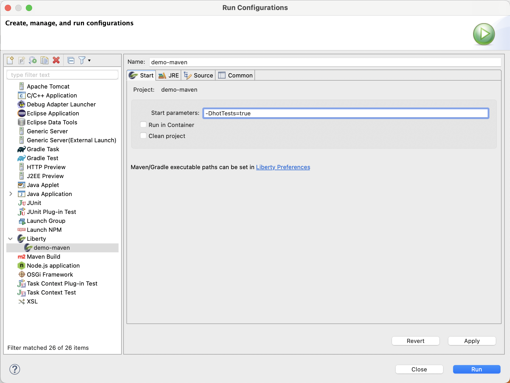
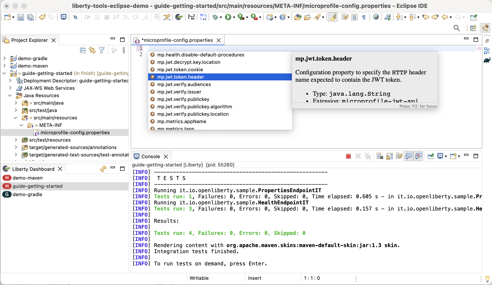
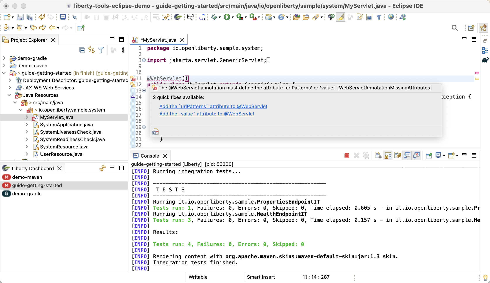

# User Guide

This guide provides detailed instructions on how to use Liberty Tools for the Eclipse IDE

- [User Guide](#user-guide)
  * [Before you begin](#before-you-begin)
    + [Software requirements](#software-requirements)
    + [Application requirements](#application-requirements)
    + [Maven and Gradle](#maven-and-gradle)
    + [Docker](#docker)
  * [Opening the Liberty dashboard view](#opening-the-liberty-dashboard-view)
  * [Accessing Liberty Tools Operations](#accessing-liberty-tools-operations)
    + [Using the Liberty dashboard view](#using-the-liberty-dashboard-view)
    + [Using the Project Explorer view](#using-the-project-explorer-view)
  * [Running your application on Liberty using dev mode](#running-your-application-on-liberty-using-dev-mode)
    + [Start](#start)
    + [Start with Configuration](#start-with-configuration)
    + [Start in container](#start-in-container)
  * [Running tests](#running-tests)
  * [Viewing test reports](#viewing-test-reports)
    + [Maven-built applications](#maven-built-applications)
    + [Gradle-built applications](#gradle-built-applications)
  * [Stopping your application](#stopping-your-application)
  * [Debugging your application](#debugging-your-application)
  * [Manually adding the Liberty nature to a project](#manually-adding-the-liberty-nature-to-a-project)
  * [Setting preferences](#setting-preferences)
  * [Configuring a Liberty server](#configuring-a-liberty-server)
  * [Developing with MicroProfile](#developing-with-microprofile)
  * [Developing with Jakarta EE](#developing-with-jakarta-ee)
  * [Importing Gradle projects](#importing-gradle-projects)
  * [Multi-module](#multi-module)
  * [Common Issues](#common-issues)

## Before you begin

### Software requirements

1. **Eclipse IDE:**

| Liberty Tools Eclipse version 	| Targeted Eclipse IDE version       	|
|:---------------------------------:|:----------:|
|  23.0.6     	| 2023-03 - Eclipse v4.27 |
|  23.0.7     	| 2023-03 - Eclipse v4.27 |
|  23.0.9       | 2023-06 - Eclipse v4.28 |
|  23.0.12      | 2023-09 - Eclipse v4.29 |
|  24.0.3       | 2023-12 - Eclipse v4.30 |
|  24.0.6       | 2024-03 - Eclipse v4.31 |
|  24.0.9       | 2024-06 - Eclipse v4.32 |
|  24.0.12      | 2024-09 - Eclipse v4.33 |
|  25.0.3       | 2024-12 - Eclipse v4.34 |

**NOTE:** Tested with each of the `Eclipse IDE for Enterprise Java and Web Developers` and `Eclipse IDE for Java Developers` packages

2. **Java:**  The Eclipse IDE itself requires Java 21. However, the application runtime [can be run with other versions of Java](#start-with-configuration), as long as they are supported by Liberty.
3. [**Liberty Tools**](installation.md)

### Application requirements

- Define a Liberty `server.xml` configuration file at the `src/main/liberty/config` location.

- Configure the [Liberty Maven Plugin](https://github.com/OpenLiberty/ci.maven#configuration) or [Liberty Gradle Plugin](https://github.com/OpenLiberty/ci.gradle#adding-the-plugin-to-the-build-script). We recommend using newer versions of the plugins as several important fixes and enhancements are included in recent versions.

  Minimum version recommendations:

  - Liberty Maven Plugin -> 3.7.1
    
  - Liberty Gradle Plugin -> 3.8

### Maven and Gradle 

Since Liberty dev mode uses the Liberty Maven or Gradle plugins to manage a Maven/Gradle project, it must be able to find a Maven/Gradle executable to launch a build.

1. Liberty Tools gives precedence to launching by way of a Maven/Gradle wrapper within the project.

    To generate a mvn wrapper into the project, run one of the following commands from your project folder:

      - `mvn wrapper:wrapper`
      - `gradle wrapper`

2. If a Maven/Gradle wrapper is not found, Liberty Tools uses a **Liberty** preference to find the Maven and Gradle installations. It does not use the preferences of the Maven/Gradle m2e/buildship Eclipse tooling:

   - [Open the Liberty preferences dialog on your Eclipse IDE](#setting-preferences)
   - Set the Maven/Gradle installation to use.
   - click on **Apply and Close** to save your changes.

3. If a Maven/Gradle installation is still not found, Liberty Tools looks at the PATH environment variable for install locations.  See the instructions in [the following section](#docker) which can also apply to finding Maven or Gradle executables.

### Docker

If using the dev mode in containers (devc) function, you must add the 'docker' executable to the PATH environment variable for the Eclipse IDE process, for example by doing one of the following options:
* On MacOS, start you eclipse IDE through Finder:
    - right-click your application and choose **Show Package Contents**.
    - Enter the newly displayed Contents folder, select MacOS, and then run Eclipse by clicking the displayed executable.
* Run the following command: `export PATH=$PATH:../path/to/docker`
* launch Eclipse by running the following command  `PATH=$PATH:../path/to/docker eclipse.exe ...`

   
## Opening the Liberty dashboard view

Click the Open Liberty icon on the toolbar.

If projects exist that are already properly configured to run on Liberty and use Liberty dev mode, those projects are automatically added to the dashboard when it opens.

If you add new projects or make changes, and you need to refresh the dashboard, use the refresh icon in the Liberty dashboard toolbar.

## Accessing Liberty Tools operations

Liberty Tools provides a series of operations to speed up application development.  These operations can be launched either through the **Liberty Dashboard** view or through the Project Explorer (or Package Explorer) views.  The multiple views can be mixed and matched, for example a run configuration created and customized through the **Liberty Dashboard** can later be launched through the Project Explorer context menu.  Another example is that an application started through the Project Explorer can be stopped through the **Liberty Dashboard** operation.

### Using the Liberty dashboard view

The Liberty dashboard provides a context menu to help run, test, and debug any configured Liberty projects. 

Maven Projects             | Gradle Projects
:-------------------------:|:-------------------------:
 | 

### Using the Project Explorer view

The Liberty Tools plugin provides a set of launch shortcut actions to the Liberty projects shown in the explorer view. 

Maven Projects             | Gradle Projects
:-------------------------:|:-------------------------:
 | 

(Note the Package Explorer view provides similar capabilities as Project Explorer.)

## Running your application on Liberty using dev mode

Three options are available to start your Liberty application in dev mode: Start, Start with configuration, or Start in a container.

### Start

To start your application in dev mode, you can either right-click the application listed in the Liberty dashboard and click the **Start** action, or right-click the application in the project explorer, select **Run As**, and select the **Liberty Start** launch shortcut.

A new Console opens to run the application in dev mode.

### Start with Configuration

To start your application in dev mode with customizations, you can either right-click on the application listed in the Liberty dashboard and click the  **Start...** action, or you can right-click the application in the project explorer, select **Run As** from the menu, and click the **Liberty Start...** launch shortcut. This action opens the Liberty configuration dialog that provides two customization tabs: **Start** and **JRE**.

Use the **Start** tab to customize how and where dev mode is run. On this tab, you can specify parameters such as `-DhotTests=true` and whether or not you want your application to run in a container.

Use the **JRE** tab to customize the Java installation to use when you run dev mode. On this tab, you can specify an alternate Java installation, an execution environment that points to the Java installation of your choice. If neither of these options are specified, the workspace-configured Java installation is used by default.

When you finish customizing the configuration, click **Run**. 

A new Console opens to run the application in dev mode. 

The configuration that is shown in the **Run Configurations** dialog is created and displayed automatically if one is not already associated with the project. If a single configuration is already associated with the project, that configuration is displayed. If multiple configurations are already associated with the project, the last configuration that ran is displayed. Re-using configurations that are not associated with the currently selected project is not allowed.

For a full list of supported parameters to customize dev mode, check out the [Liberty Maven dev goal parameters](https://github.com/OpenLiberty/ci.maven/blob/main/docs/dev.md#additional-parameters) or the [Liberty Gradle dev task parameters](https://github.com/OpenLiberty/ci.gradle/blob/main/docs/libertyDev.md#command-line-parameters).

### Start in container

If you want to use dev mode for containers, you can either right-click on the application listed in the Liberty dashboard, and click the **Start in container** action. Alternatively, you can right-click the application in the project explorer, select **Run As** on the menu, and click the `Liberty Start in Container` launch shortcut.

For more information on dev mode for containers, check out the [Liberty Maven devc goal](https://github.com/OpenLiberty/ci.maven/blob/main/docs/dev.md#devc-container-mode) or the [Liberty Gradle libertyDevc task](https://github.com/OpenLiberty/ci.gradle/blob/main/docs/libertyDev.md#libertydevc-task-container-mode).

## Running tests

Once your application is running on Liberty using dev mode, you can easily run the tests that are provided by your application. 

To run tests, you can either right-click on the application listed in the Liberty dashboard, and click on the **Run tests** action, or you can right-click on the application in the project explorer, select **Run As** from the menu, and click the **Liberty Run Tests** launch shortcut.

The tests are run in the corresponding console.

## Viewing test reports

Once you finish running your application's tests, you can access the test reports.

### Maven-built applications

To view the integration test report you can either right-click on the application listed in the Liberty dashboard, and click the **View integration test report** action, or you can right-click the application in the project explorer, select **Run As** on the menu, and click on the **Liberty View Integration Test Report** launch shortcut.

To view the unit test report for Maven built applications, you can either right-click on the application listed in the Liberty dashboard and click the **View unit test report** action, or you can right-click the application in the project explorer, select **Run As**, and select the **Liberty View Unit Test Report** launch shortcut.

### Gradle-built applications

To view the test report, you can either right-click the application listed in the Liberty dashboard and click the **View test report** action, or you can right-click on the application in the project explorer, select **Run As** on the menu, and click the **Liberty View Test Report** launch shortcut.

Test reports are opened either in your Eclipse IDE's internal browser or an external browser, depending on your Eclipse IDE browser configuration preferences.

## Stopping your application

To stop your application, you can either right-click on the application listed in the Liberty dashboard, and click on the **Stop** action, or you can right-click on the application in the project explorer, select **Run As** on the menu, and click the **Liberty Stop** launch shortcut.

## Debugging your application

To debug your application, you can start dev mode with the debugger automatically attached to the Liberty server JVM running your application.

To start dev mode with the debugger attached, right-click on the application in the project explorer, select **Debug As** on the menu, and click on one of the launch shortcut start actions: **Liberty Start**, **Liberty Start...**, or **Liberty Start in Container**. Alternatively, you can right-click on the application in the Liberty dashboard and select **Debug**, **Debug...**, or **Debug in container** for equivalent behavior. 

The launch shortcut start actions that are shown when you select **Debug As** through the explorer menu are equivalent to the ones that are shown when you select `Run As`. The main difference is that when you select **Debug As**, the debugger is automatically attached to the Liberty server JVM running your application.

If you select the **Liberty Start...** launch shortcut action, the Debug Configurations dialog is opened. There, you can customize the dev mode parameters before you  launch your application in dev mode.

Under the `Source` tab you can also customize the source lookup locations for your debug session. By default, the source for the running project as well as any dependency projects that exist within the workspace are added. You can add additional source lookup locations by clicking the `Add` button. 

When you finish with the customizations, click the **Debug** button to launch dev mode and attach the debugger. 

Additionally, if you do not start your application with the Debug option, you can attach a debugger at any time using the **Connect Liberty Debugger** context menu action. 

From the Debug View in the Debug Perspective, right-click on the launched application and select **Connect Liberty Debugger**. 

## Manually adding the Liberty nature to a project

You can manually classify a project as a Liberty project with the Liberty Tools for Eclipse IDE . This capability is useful in cases where the tool , due to project customizations, does not recognize a project to be a Liberty project; even though, it might be a Liberty project.

To manually classify the project as a Liberty project, go to the project explorer view, right-click the project, select the **Configure** on the menu and click **Enable Liberty**. 

After the project is classified as a Liberty project, the project is automatically added to the Liberty dashboard, and you can start using the provided action commands. Similarly, you can start using the Liberty launch shortcuts through the project explorer **Run As** and **Debug As** menu entries.

## Setting preferences
You can set some preferences through the Liberty Tools for Eclipse preference panel.
To set these preferences, open the preference dialog, and click **Liberty** from the dialog sidebar menu.

Set your preferences and click **Apply and Close**.  

## Configuring a Liberty server

Liberty configuration assistance provides editing assistance, such as [code completion, diagnostics, and quick-fixes](https://github.com/OpenLiberty/liberty-language-server#features), in Liberty `server.xml`, `server.env`, and `bootstrap.properties` files.

1. Start the project in dev mode using one of the previously described dashboard start commands.  These commands install the Liberty features required for your app and allow the generation of a corresponding `server.xml` XSD schema file.

2. Open any of the supported Liberty configuration files using the **Generic Text Editor**.

3. To use content assist enter <kbd>Ctrl</kbd> + <kbd>Space</kbd> at any point within the document.

server.xml             | bootstrap.properties
:-------------------------:|:-------------------------:
 | 

Liberty configuration assistance is offered through the Liberty Config Language Server. For more information, see the [project documentation in GitHub](https://github.com/OpenLiberty/liberty-language-server#liberty-config-language-server).

## Developing with MicroProfile

Liberty Tools editing assistance provides hover-over, code completion, and diagnostics in configuration and application files for MicroProfile APIs.

1. Start the project in dev mode using one of the previously described dashboard start commands.
2. Open a Java or `microprofile-config.properties` file. 
3. To use MicroProfile-specific code completion, press <kbd>Ctrl</kbd> + <kbd>Space</kbd> / <kbd>Cmd</kbd> + <kbd>Space</kbd> anywhere within the document. A drop-down list of completion suggestions appears.

Though [this article](
https://microprofile.io/2020/09/25/announcement-language-server-for-microprofile-and-the-tools-for-microprofile-vs-code-extension/) is not written for Liberty Tools specifically, it shows the MicroProfile Language Server tooling features in another context.

MicroProfile EE API configuration assistance is offered through Eclipse LSP4MP, the Language Server for MicroProfile. For more information, see the [project documentation in GitHub](https://github.com/eclipse/lsp4mp#eclipse-lsp4mp---language-server-for-microprofile).

## Developing with Jakarta EE

Liberty Tools editing assistance provides code completion, diagnostics, and quick-fixes in application files for Jakarta EE.

1. Start the project in dev mode using one of the previously described dashboard start commands.
2. Open a Java file. 
3. To use Jakarta EE-specific code completion, press <kbd>Ctrl</kbd> + <kbd>Space</kbd> / <kbd>Cmd</kbd> + <kbd>Space</kbd> anywhere within the document. A drop-down list of completion suggestions and code snippets appears.

4. To use Jakarta EE-specific quick-fixes, hover over a supported Jakarta EE error. A drop-down list of quick-fixes appears.

Jakarta EE API configuration assistance is offered through Eclipse LSP4Jakarta, the Language Server for Jakarta EE. For more information, see the [project documentation in GitHub](https://github.com/eclipse/lsp4jakarta#eclipse-lsp4jakarta).

## Importing Gradle projects

The Gradle Eclipse plugins (Buildship) run a simple Gradle build upon import (**Import -> Gradle -> Existing Gradle Project**) to query project information.

If this build does not complete successfully, the Liberty Tools function might not work correctly.

For example, if your project uses a Gradle wrapper at a Gradle version less than v8.4, it does not support Java 21 per [matrix](https://docs.gradle.org/current/userguide/compatibility.html), but the Java 21+ workspace JRE is required for running Liberty Tools.

One approach to resolve this incompatibility is to configure the preference at:
**Preferences -> Gradle -> Java home** to refer to a Java installation that is compatible with the level of Gradle in your `gradlew` wrapper.

More generally, the Gradle Eclipse preferences and project Java requirements must be compatible.

## Multi-module 
Gradle multi-project builds are not supported at this time.

Liberty Tools offers a level of support for Maven multi-module projects. Rather than attempt to fully model the multi-project build, we make a heuristic "best guess" at the project structure, and allow the user to edit and customize the start command they use.  Liberty Tools also might offer a choice of dashboard entries, one for the top-level, aggregate module and one for a specific server module.  The top-level module dashboard entry might not be usable in the case that Liberty dev mode is not able to guess the right starting module on its own, in which case the server module entry can provide a useful starting point instead. For more information, see the [Liberty Maven plugin multi-module documentation ](https://github.com/OpenLiberty/ci.maven/blob/main/docs/dev.md#multiple-modules).

## Common Issues

For an updated list of commonly-seen issues, see [this wiki article](https://github.com/OpenLiberty/liberty-tools-eclipse/wiki/Common-Issues).
